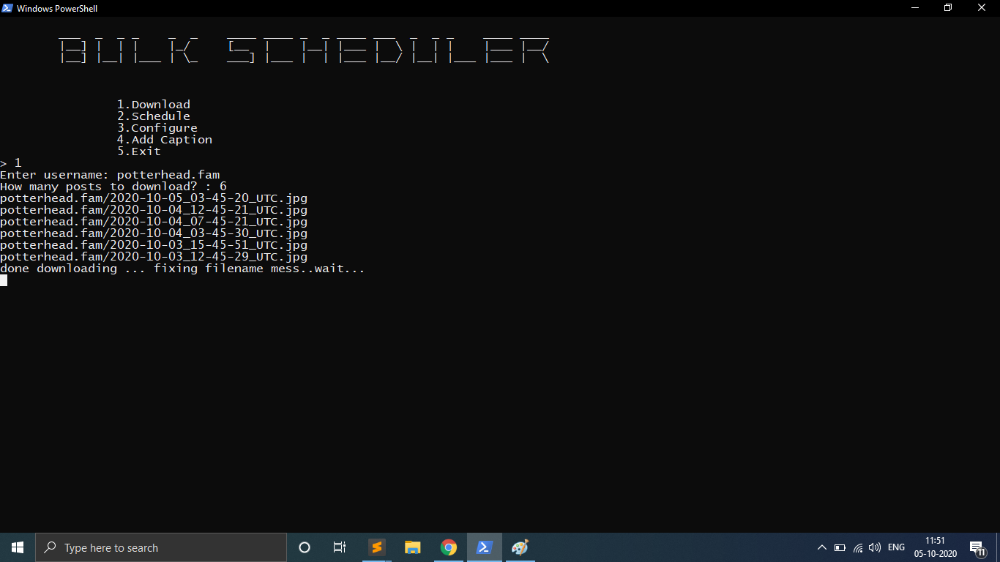
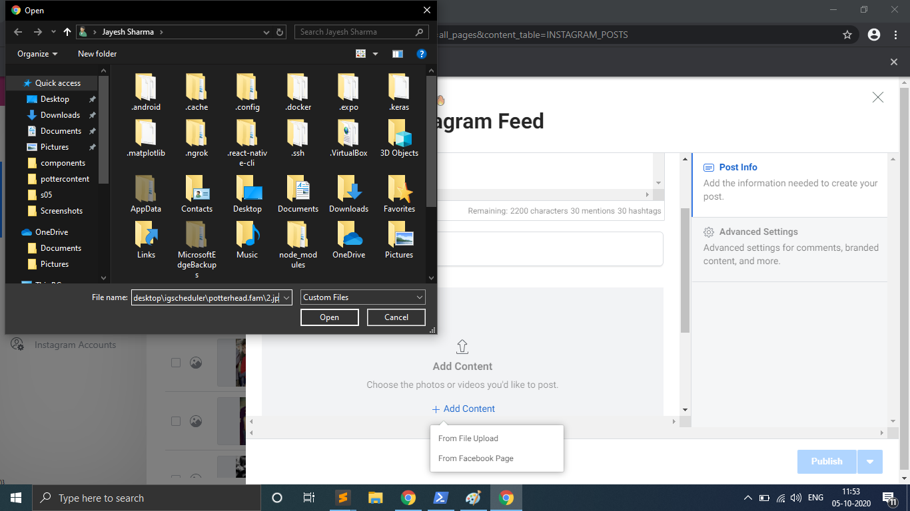

## Bulk Scheduler for Instagram

This is selenium based automation tool. which can scheduler your posts for next 6 months for instagram.

# Usage:

- Download chrome driver from [here](https://chromedriver.chromium.org/downloads)
- run
  ```
  pip install -r requirements.txt
  ```
  ```
  python3 bulkscheduler.py
  ```

# Working Screenshots




# Contribution

If you find any issue or want some new feature to get added in this script, raise an issue or contact me directly.
